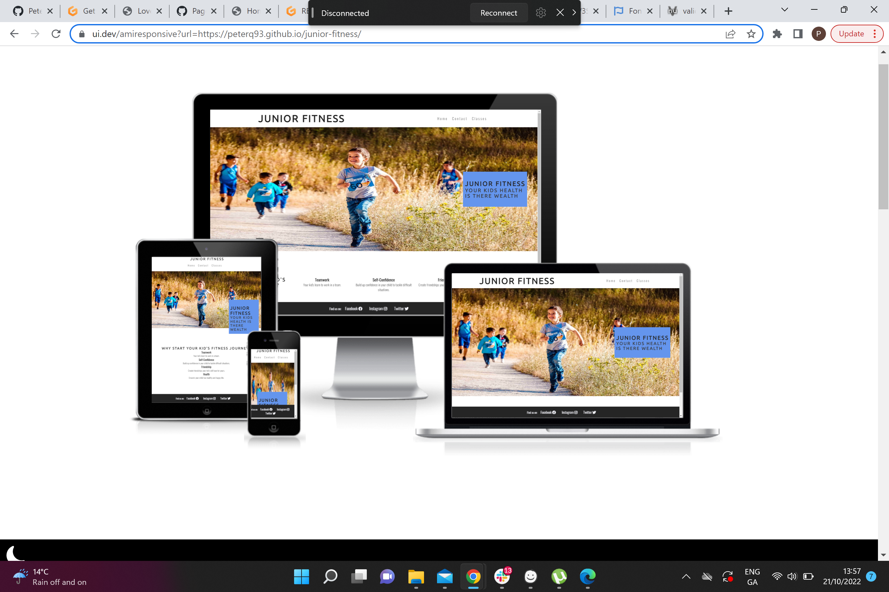

# **Junior Fitness**
 
 Junior Fitness is a website which offers fitness classes for kids in Wexford, Ireland. We offer a wide range of classes which will build friendship, fitness and character in young kids. The site will target parents who would want there kids to socialise and try different sports.

​
## Table of contents:
1. [**Site Overview**](#site-overview)
1. [**Planning stage**](#planning-stage)
    * [***Target Audiences***](#target-audiences)
    * [***Site Aims***](#site-aims)
    * [***Wireframes***](#wireframes)
    * [***Color Scheme***](#color-scheme)
    * [***Typography**](#typography)
1. [**Current Features Common to all pages**](#current-features-common-to-all-pages)
    * [***Navigation Bar:***](#navigation-bar)
    * [***The rest of your features***](#features)
    * [**Footer**](#footer)
1. [**Individual Page Content features**](#individual-page-content-features)
    * [**About Page Content**](#about-page-content)
    * [**Teachings Page Content**](#teachings-page-content)
    * [**Community Page Content**](#community-page-content)
    * [**Contact Page Content**](#contact-page-content)
    * [**Form Feedback Page Content**](#form-feedback-page-content)
1. [**Future-Enhancements**](#future-enhancements)
1. [**Testing Phase**](#testing-phase)
1. [**Deployment**](#deployment)
1. [**Tech**](#tech)
1. [**Credits**](#credits)
    * [**Honorable mentions**](#honorable-mentions)
    * [**General reference**](#general-reference)
    * [**Content**](#content)
    * [**Media**](#media)
​
## **Planning stage**

### **Target Audiences**
​Looking to target parents and children.
​
​
### **Site Aims**
​Junior Fitness aims to bring a range of fitness classes to kids.
We have a simple and easy to follow website to see all our classes and playdates.

​
### **Color Scheme**
The color scheme implemented throughout the site is a mixture between:
- #252525 for h1 and h2
- #fff for footer font colour
- #252525 for footer background colour
- #3a3a3a for the body
- #fff for the text in the form
- rgba(60, 60, 60, 0.6) for the background in the form
- #252525 for the headings and border in the classes page
- rgba(0,0,0,0.2) for the hover on the cards on classes page

All colours have been implemented to compliment each other and be aesthetically pleasing.
 
​
## **Typography**
​

​
## **Current Features Common to all pages**
- Navigation bar is the same on each page
- Footer is the same on each page

​
## **Navigation Bar**
- Contains the title for the webpage with the link to homepage built in all on the left handside of the page
- Has 3 pages all on the right hand side of the page with built in links to each page

​
## **Features**
- Homepage 
  - Homepage at the start of the page with appropriate alt tag
  - Inside the image is a text box with a h2 and h3 heading#
  - Below is 4 divs containing info as to why you should pick this page
  - 4 divs are aligned using flexbox and the font colour and background contrast with the page

- Contact Page
  - Page centers around a form to sign your kids up to classes
  - The form wants 4 inputs Name, Email, Phone and a Message for additonal information
  - At the bottom of the form there is a submit button to send your info it goes to a link from Code Institute and returns to you the info you just typed in
  - Behind the form there is a picture which takes up the background it is blurred to contrast well with the form on the page
  - The 4 inputs and sumbit buttons are all styled with some font awesome icons
  - The form is positioned in the middle of the page using flex and align-items

- Classes Page
  - We have 6 cards with classes displayed 
  - They are split up into 2 divs with 3 divs inside each
  - They are aligned using flex 
  - Inside the cards at the top is an image of the class example, under it is a h2 for the class and then we have details of the class inside an unordered list
  - All headings within the cards are centered in the div
  - Inside the list is the day, time and location of the activities
  - Wrapped around the cards is a border which fits inline with the colour contrast for the page
   

## **Footer**

​
## **Future-Enhancements**
​
A
​
## **Testing Phase**
​

​
​
## **Bugs**
​

​
***
## **Deployment**
I deployed the page on GitHub pages via the following procedure: -
​
1. From the project's [repository](pageurl), go to the **Settings** tab.
2. From the left-hand menu, select the **Pages** tab.
3. Under the **Source** section, select the **Main** branch from the drop-down menu and click **Save**.
4. A message will be displayed to indicate a successful deployment to GitHub pages and provide the live link.
​
You  can find the live site via the following URL - [live webpage](https://yoururlhere)
***
​
## **Tech**

​
## **Credits**
### **Honorable mentions**
​
### **Content:**
​

  
### **Media:**
​

[def]: ..assets