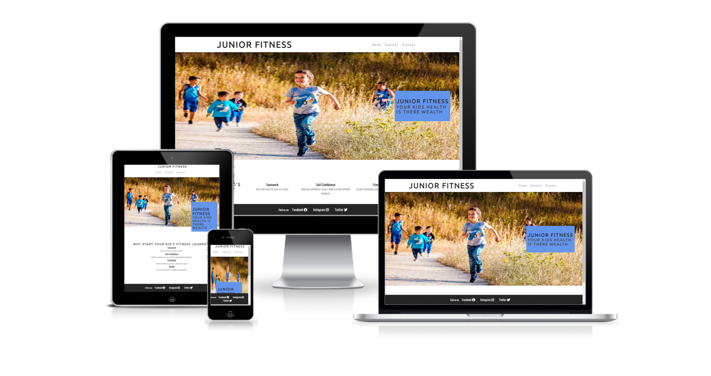
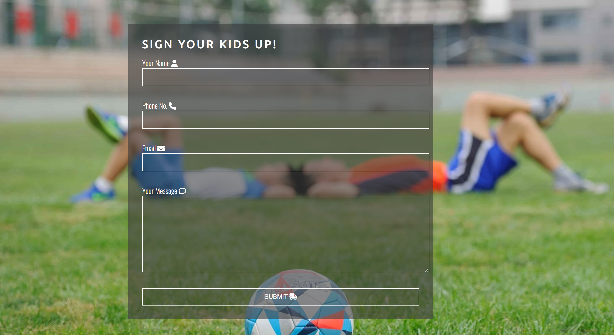
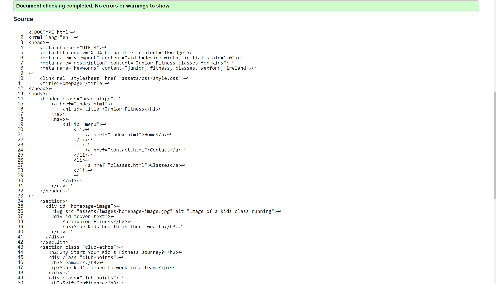
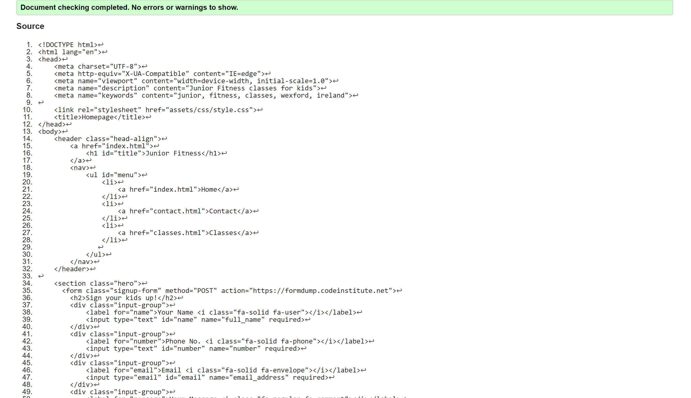
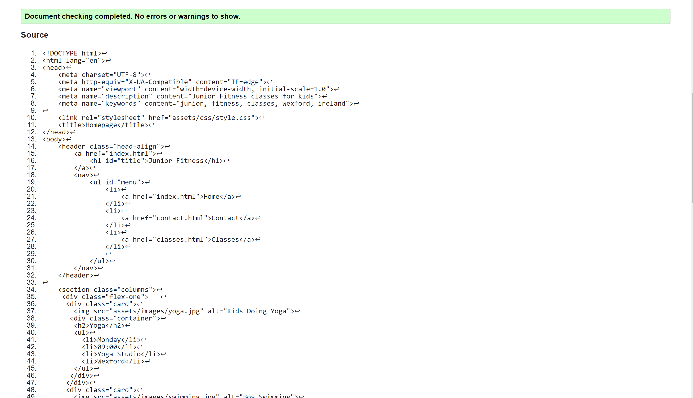
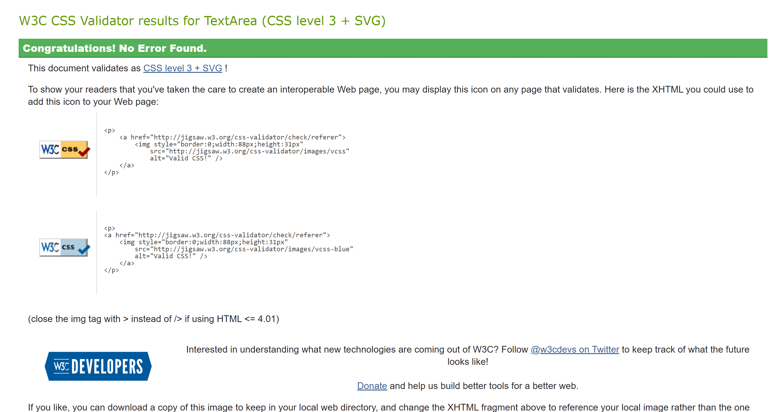
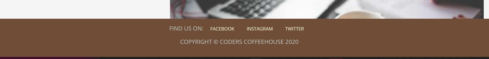

# **Junior Fitness**
 
 Junior Fitness is a website which offers fitness classes for kids in Wexford, Ireland. We offer a wide range of classes which will build friendship, fitness and character in young kids. The site will target parents who would want there kids to socialise and try different sports.

​
## Table of contents:
1. [**Site Overview**](#site-overview)
1. [**Planning stage**](#planning-stage)
    * [***Target Audiences***](#target-audiences)
    * [***User Stories***](#user-stories)
    * [***Site Aims***](#site-aims)
    * [***Wireframes***](#wireframes)
    * [***Color Scheme***](#color-scheme)
    * [***Typography***](#typography)
1. [**Current Features Common to all pages**](#current-features-common-to-all-pages)
    * [***Navigation Bar***](#navigation-bar)
    * [***Features***](#features)
    * [***Footer***](#footer)
1. [**Testing Phase**](#testing-phase)
1. [**Bugs**](#bugs)
1. [**Deployment**](#deployment)
1. [**Credits**](#credits)
   
## **Planning stage**

### **Target Audiences**
​Looking to target parents and children.
 
 - Parents looking to get some excercise for their kids 
 - Parents wanting kids to experince different sports
 - Parents looking to build character and friendship for there kids 

### **User Stories** 

 - As a user i want to know more about the group
 - As a user i want to be able to get in contact 
 - As a user i want to be able to see what classes available 
 - As a user i want to see social media links
 - As a user i want an easy to use navigation bar
​
​
### **Site Aims**
​Junior Fitness aims to bring a range of fitness classes to kids.
We have a simple and easy to follow website to see all our classes and playdates.

- Inform parents of fitness classes for kids 
- Simple and easy to use interface 
- Ability to get in contact 
- Ability to show classes available 

​
### **Color Scheme**
The color scheme implemented throughout the site is a mixture between:
- #252525 for h1 and h2
- #fff for footer font colour
- #252525 for footer background colour
- #3a3a3a for the body
- #fff for the text in the form
- rgba(60, 60, 60, 0.6) for the background in the form
- #252525 for the headings and border in the classes page
- rgba(0,0,0,0.2) for the hover on the cards on classes page

All colours have been implemented to compliment each other and be aesthetically pleasing.
 
​
## **Typography**

In the making of this website i used two font styles i taught complimented each other and the layout of the website.

- Ubuntu
- Oswald
​

​
## **Current Features Common to all pages**
- Navigation bar is the same on each page
- Footer is the same on each page

​
## **Navigation Bar**
- Contains the title for the webpage with the link to homepage built in all on the left handside of the page
- If you hover over either of the three pages on the right it will underline the one you are hovering on
- Has 3 pages all on the right hand side of the page with built in links to each page

​
## **Features**
- Homepage 
  - Homepage at the start of the page with appropriate alt tag
  - Inside the image is a text box with a h2 and h3 heading#
  - Below is 4 divs containing info as to why you should pick this page
  - 4 divs are aligned using flexbox and the font colour and background contrast with the page

- Contact Page
  - Page centers around a form to sign your kids up to classes
  - The form wants 4 inputs Name, Email, Phone and a Message for additonal information
  - At the bottom of the form there is a submit button to send your info it goes to a link from Code Institute and returns to you the info you just typed in
  - Behind the form there is a picture which takes up the background it is blurred to contrast well with the form on the page
  - The 4 inputs and sumbit buttons are all styled with some font awesome icons
  - The form is positioned in the middle of the page using flex and align-items

  

- Classes Page
  - We have 6 cards with classes displayed 
  - They are split up into 2 divs with 3 divs inside each
  - They are aligned using flex 
  - Inside the cards at the top is an image of the class example, under it is a h2 for the class and then we have details of the class inside an unordered list
  - All headings within the cards are centered in the div
  - Inside the list is the day, time and location of the activities
  - Wrapped around the cards is a border which fits inline with the colour contrast for the page
  - If you hover over each card it will highlight it 
   
   

## **Footer**
- The footer is a solid #252525 bar which is constant on every page
- It has the social media links for the website
- They are centered in the middle of the screen with a text colour of #F8F8FF

 

​
## **Testing Phase**
- I tested all 3 html documents using the W3C validator
  - Index.html
  - There was only one fail on the html validator which applied to the header on all 3 of the pages i forgot to put ul on the unordered list i only had u

  - Contact.html

  - Classes.html

​

  - CSS

​

​
## **Bugs**
​Navigation Bar
- I had float left and right on the nav bar but when i went down into smaller screen size they just collapsed onto each other
- I fixed this by using flex to align them
- The nav bar starts as a row but as it gets smaller it goes into a column

Images
- When i added all the images they were all very high quaility which made the website slow and preform bad on lighthouse
- I went to a site called [Image Compressor](https://imagecompressor.com/) and resized all the images and the site has improved now
- I had a size set for height on an image on the homepage and the images in the classes page but when i went to a smaller screen size then the pictures seemed to lose quality and stretch so i set the height to auto on each image

Footer 
- I found when i went to a smaller screen the text in the footer disapeared
- To fix this i used a media querie fixing the size of the text and the padding between them to fit on the screen

Contact Form
- I found when i entered all the data in the form it returned nothing
- To fix this i used the link we had in our Love Running sign up challenge

Validator 
- When i ran the validator i had one error it was in the header in the unordered list 
- I had forgot to put ul on the list i had only put u

Classes 
- When i had the 6 classes in first i had just 6 divs but i found when i used flexbox with them it did not fit in the screen right
- To fix this i decided to add 2 more divs and split the first 6 divs into them i used flexbox to align them to fit nicely on the page

​
***
## **Deployment**
I deployed the page on GitHub pages via the following procedure: -
​
1. From the project's [repository](pageurl), go to the **Settings** tab.
2. From the left-hand menu, select the **Pages** tab.
3. Under the **Source** section, select the **Main** branch from the drop-down menu and click **Save**.
4. A message will be displayed to indicate a successful deployment to GitHub pages and provide the live link.
​
You can find the live site via the following URL - [Junior Fitness](https://peterq93.github.io/junior-fitness/index.html)
***
​

​
## **Credits**

Navigation Bar
- I credit the nav bar to the [Love Running Project](https://github.com/PeterQ93/love-running) i styled my one a bit different and aligned it using flexbox

Homepage Image
- I took inspiration from the [Love Running Project](https://github.com/PeterQ93/love-running) again for the homepage image i felt it suited well with the site

Footer
- For the footer i took inspiration from our lessons we done Coders Coffee House a project for coders who love coffee 
​
Contact Form 
- for the contact form i used [Kevin Powell](https://www.youtube.com/kepowob) on youtube and i looked at previous examples in our coursework for forms

Classes
- For the 6 classes i got the idea from [W3C Schools](https://www.w3schools.com/w3css/w3css_cards.asp) i then found some images to fit and put in the appropriate content

​
​